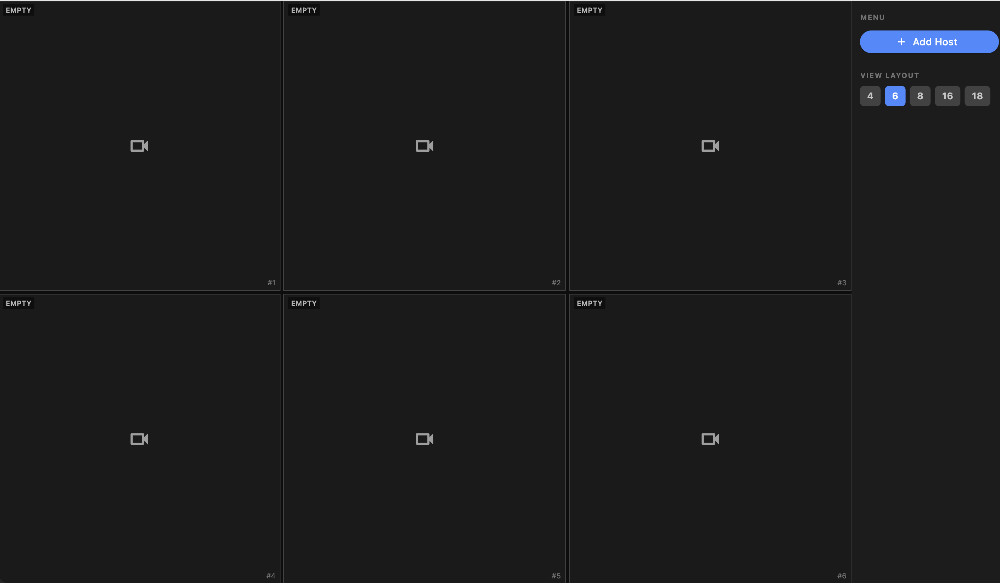

# Cam Viewer

A desktop, mobile, and Android TV app for monitoring multiple RTSP IP cameras simultaneously — designed for DVRs and NVRs with up to 18 channels.

---

## Tested Platforms

| Platform | Status |
|---|---|
| macOS | ✅ Tested |
| Android (phone/tablet) | ✅ Tested |
| Android TV (Android 9 & 14) | ✅ Tested |

---

## Features

### Multi-Camera Grid
- View **4, 6, 8, 16, or 18** camera streams at once in a responsive grid layout.
- Each cell shows a live RTSP stream. Empty slots display a placeholder until a channel is assigned.
- Cells are numbered for easy reference.

### Add & Manage Hosts
- Add any DVR/NVR by entering its IP address or hostname (with optional port and custom path).
- Supports optional **username and password** credentials.
- Manually pick which **channels (1–18)** to display using a toggle grid.
- Edit or delete hosts at any time.

### Fullscreen Mode
- Tap or select any camera cell to go **fullscreen**.
- Grid streams are paused while fullscreen is active to avoid overloading the DVR.
- Press **Esc**, the back button, or the remote **Back** key to return — the grid resumes automatically.

### Always Full Resolution
- All streams use the full-resolution feed from the DVR, both in the grid and fullscreen.

### Desktop & Mobile
- **Desktop / Android TV:** collapsible side menu with layout switcher and host controls. Press **Esc** / remote **Back** once to hide/show the menu; press twice within 2 seconds to exit.
- **Mobile:** floating button opens a settings page with the same controls.

### Android TV
- Appears in the Android TV home screen launcher with a banner tile.
- Fully navigable with a D-pad remote — use the **directional keys** to move between camera cells and press **Select / OK** to open fullscreen.
- No touchscreen required.
- Supports Android TV **9 (API 28)** and **14 (API 34)** and above.
